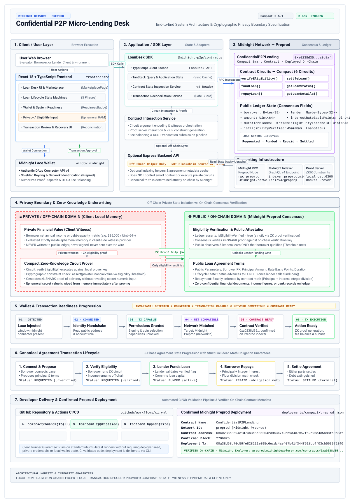

# Confidential P2P Micro-Lending Desk

[](https://github.com/Karmansingh09/confidential-p2p-lending/actions/workflows/ci.yml)
[](https://preprod.midnightexplorer.com)
[](https://midnight.network)
[](https://github.com/Karmansingh09/confidential-p2p-lending)
[](https://www.typescriptlang.org)
[](https://risein.com)

A peer-to-peer micro-lending platform powered by **Midnight Network** and **Compact** smart contracts. Borrowers prove their financial creditworthiness and income sufficiency in **Zero-Knowledge (ZK)** without exposing confidential bank statements, tax documents, debt ratios, or personally identifiable financial data to lenders, miners, or public chain observers.

---

## Verified Midnight Preprod Deployment

The smart contract **`ConfidentialP2PLending`** has been formally compiled, proved, fee-balanced, signed, and deployed to **Midnight Preprod**.

| Property | Value |
| :--- | :--- |
| **Contract Name** | `ConfidentialP2PLending` |
| **Network** | `Midnight Preprod` |
| **Contract Address (Hex)** | `0xa0238d3594e1d74b3d5e85254239a34749bb9d4c7957f52b96e4c5a88fa0b8af` |
| **Raw Contract Address** | `a0238d3594e1d74b3d5e85254239a34749bb9d4c7957f52b96e4c5a88fa0b8af` |
| **Deployment Transaction ID** | `00a38d58b70c59fe828211a095c6ecdc4ae407b41f344f518bb4f03cb563975240` |
| **Transaction Hash** | `489ea6d715d9a06c4cf3c0e658b4267d6d784e7657bc1609ccc78de904627eaa` |
| **Confirmed Block Height** | `2706926` |
| **Deployer Public Key** | `3cd20baf49d3a2156ab48985cc4de72c1b52a2a6c228cb4616190b7d4e44f532` |
| **Compact Source SHA-256** | `608d88fbbf3380ebf479d6cfb4310dd9dd8eb0db124797de16a0fe77f9785f53` |
| **Deployment Status** | `Confirmed (On-Chain)` |
| **Preprod Block Explorer** | [**View Contract on Midnight Explorer**](https://preprod.midnightexplorer.com/contracts/0xa0238d3594e1d74b3d5e85254239a34749bb9d4c7957f52b96e4c5a88fa0b8af) |

Deployment artifact record: [`deployments/compact/preprod.json`](deployments/compact/preprod.json).

---

## Core Problem & Value Proposition

Traditional uncollateralized lending presents an unavoidable privacy dilemma:
1. **The Over-Disclosure Dilemma**: Borrowers must surrender unencrypted financial statements, payroll receipts, credit scores, and employer information to centralized underwriting services or public blockchains.
2. **Data Leakage Risk**: Surrendered documents are vulnerable to data breaches, identity theft, predatory pricing, and public blockchain surveillance.
3. **The Midnight ZK Solution**: By leveraging Midnight's dual-state architecture (private off-chain state + public ledger state), borrowers generate client-side cryptographic zero-knowledge proofs. Lenders verify that the borrower meets the required creditworthiness threshold without ever seeing the underlying private financial figures.

---

## System Architecture



---

## Zero-Knowledge Privacy Model & Architecture

### 1. Dual-State Partitioning
Midnight separates state into two distinct domains:
- **Public Ledger State**: Globally agreed upon by network consensus and visible to all participants.
  - `borrower`: 32-byte public key of the borrower (`Bytes<32>`).
  - `lender`: Optional 32-byte public key of the funder (`Maybe<Bytes<32>>`).
  - `amount`: Loan principal in smallest token units (`Uint<64>`).
  - `interestRateBasisPoints`: Annualized interest rate in basis points (`Uint<16>`, e.g., `500` = 5.00%).
  - `durationBlocks`: Duration of the loan agreement in block units (`Uint<32>`).
  - `status`: Current agreement lifecycle state (`LoanStatus`).
  - `isEligibilityVerified`: Boolean flag asserted true strictly through ZK proof verification (`Boolean`).
- **Private Off-Chain State (Witness)**:
  - `getPrivateFinancialValue()`: Client-side Compact witness function executed locally on the borrower's device.
  - Returns a `Uint<64>` representing the borrower's private credit metric (e.g., net annual income or debt-capacity metric).
  - The raw numeric value is consumed exclusively by the local proof server container to generate constraints and is discarded immediately after proof synthesis. It is never transmitted across network boundaries.

### 2. The 5-Phase Agreement Lifecycle

```
  +----------------------------------------------------------------------------+
  |                                                                            |
  |  [Phase 1: REQUESTED (Unverified)]                                         |
  |     * Borrower initializes loan parameters (amount, rate, duration)        |
  |     * Status: REQUESTED, isEligibilityVerified: FALSE                     |
  |                                                                            |
  |                                     |                                      |
  |                        verifyEligibility() [ZK PROOF]                      |
  |                                     v                                      |
  |                                                                            |
  |  [Phase 2: REQUESTED (Verified)]                                           |
  |     * Local ZK proof attests privateValue >= eligibilityThreshold          |
  |     * Status: REQUESTED, isEligibilityVerified: TRUE                      |
  |                                                                            |
  |                                     |                                      |
  |                             fundLoan() [LENDER SIGN]                       |
  |                                     v                                      |
  |                                                                            |
  |  [Phase 3: FUNDED]                                                         |
  |     * Lender commits capital and records lender public key                 |
  |     * Status: FUNDED                                                       |
  |                                                                            |
  |                                     |                                      |
  |                            repayLoan() [BORROWER SIGN]                     |
  |                                     v                                      |
  |                                                                            |
  |  [Phase 4: REPAID]                                                         |
  |     * Exact principal + interest obligation validated by Euclidean math   |
  |     * Status: REPAID                                                       |
  |                                                                            |
  |                                     |                                      |
  |                           settleLoan() [SYMMETRICAL]                       |
  |                                     v                                      |
  |                                                                            |
  |  [Phase 5: SETTLED] (Terminal State)                                       |
  |     * Symmetrical closure callable by borrower or lender                   |
  |     * Extinguishes debt obligations permanently                            |
  |                                                                            |
  +----------------------------------------------------------------------------+
```

### 3. Euclidean Mathematical Obligation Guarantees
To prevent rounding exploits and fractional remainder attacks, repayment obligation is enforced using integer field division:
$$\text{Interest} = \left\lfloor \frac{\text{Principal} \times \text{RateBasisPoints}}{10\,000} \right\rfloor$$
$$\text{Total Obligation} = \text{Principal} + \text{Interest}$$

Any repayment transaction offering less than $\text{Total Obligation}$ is rejected by contract assertion.

---

## Repository Structure

```text
confidential-p2p-lending/
├── contracts/                        # Compact smart contracts & client SDK
│   ├── src/
│   │   └── index.compact             # Canonical Compact smart contract (SHA-256 pinned)
│   ├── client/
│   │   ├── index.ts                  # Public library exports
│   │   ├── loan-api.ts               # Strongly typed client API & facade
│   │   └── types.ts                  # Pure client-side lifecycle models
│   ├── managed/                      # Compiled ZK circuits, ZKIR & keys
│   │   ├── contract/                 # TypeScript runtime contract bindings
│   │   ├── keys/                     # Prover & verifier keys for 6 circuits
│   │   └── zkir/                     # Zero-knowledge intermediate representations
│   ├── package.json                  # Workspace package config
│   └── tsconfig.json                 # TypeScript compiler configuration
├── frontend/                         # React 18 + TypeScript + Vite web dashboard
│   ├── src/
│   │   ├── components/               # Lifecycle UI panels, steppers, and monitors
│   │   ├── lib/                      # Core business services & wallet adapters
│   │   ├── types/                    # Frontend domain models & interfaces
│   │   └── App.tsx                   # Main dashboard application
│   ├── package.json                  # Frontend workspace config
│   └── vite.config.ts                # Vite build configuration
├── deploy/                           # Deployment wiring & constructor arguments
│   ├── args.js                       # Preprod constructor parameters
│   └── witnesses.js                  # Deployment witness fixtures
├── deployments/                      # Recorded on-chain deployment receipts
│   └── compact/
│       └── preprod.json              # Confirmed Preprod contract address & tx metadata
├── scripts/                          # Diagnostic & utility tooling
│   ├── diagnose-pipeline.mjs         # Non-broadcasting prove + balance diagnostic
│   └── fix-undici-dispatcher.mjs     # Node 24 native fetch dispatcher protection hook
├── tests/                            # Comprehensive automated test suite (682 tests)
│   ├── api.test.js                   # Canonical lifecycle client API tests
│   ├── circuits.test.js              # Compact circuit logic tests
│   ├── creation.test.js              # Loan request creation tests
│   ├── eligibility.test.js           # Confidential ZK underwriting tests
│   ├── frontend-*.test.js            # Frontend integration & component tests
│   ├── funding.test.js               # Lender funding transition tests
│   ├── repayment.test.js             # Repayment obligation verification tests
│   └── settlement.test.js            # Protocol finality settlement tests
├── compact.toml                      # Compact Deployer & network configuration
├── package.json                      # Workspace root package config
└── .github/
    └── workflows/
        └── ci.yml                    # Automated CI/CD workflow (clean runner compatible)
```

---

## Smart Contract Circuits

The contract [`contracts/src/index.compact`](contracts/src/index.compact) exposes six canonical circuits:

| Circuit Name | Classification | Caller | Purpose |
| :--- | :--- | :--- | :--- |
| **`verifyEligibility`** | `LOCAL_PROOF` | Borrower | Proves borrower income satisfies threshold in ZK via witness; asserts public flag on ledger. |
| **`fundLoan`** | `TRANSACTION_EXECUTION` | Lender | Validates verified status, records lender public key, and transitions state to `funded`. |
| **`repayLoan`** | `TRANSACTION_EXECUTION` | Borrower | Asserts exact repayment obligation ($Principal + Interest$) and marks loan as `repaid`. |
| **`settleLoan`** | `TRANSACTION_EXECUTION` | Borrower or Lender | Symmetrical closure circuit; transitions loan to final `settled` state. |
| **`getLoanStatus`** | `STATE_READ` | Anyone | Read-only circuit returning current `LoanStatus` enum. |
| **`getLoanDetails`** | `STATE_READ` | Anyone | Read-only circuit returning complete `LoanDetails` structured record. |

---

## Client SDK & Facade API (`LoanDesk`)

The `@midnight-p2p/contracts` client package encapsulates contract state interactions and ZK proof invocations into a clean, strongly typed facade:

```typescript
import {
  createLoan,
  verifyLoanEligibility,
  fundLoan,
  repayLoan,
  settleLoan,
  calculateRepaymentObligation,
} from '@midnight-p2p/contracts';

// 1. Borrower creates loan request
const loan = createLoan({
  borrowerPk: borrowerPublicKey,
  principalAmount: 25_000n,
  interestRateBasisPoints: 500n, // 5.00% simple interest
  durationBlocks: 100n,
  eligibilityThreshold: 30_000n,
});

// 2. Borrower proves eligibility in Zero-Knowledge (private value remains off-chain)
const verified = verifyLoanEligibility({
  contractState: loan.contractState,
  borrowerPk: borrowerPublicKey,
  privateFinancialValue: 42_000n, // Secret witness - never revealed on-chain
});

// 3. Lender funds the verified request
const funded = fundLoan({
  contractState: verified.contractState,
  lenderPk: lenderPublicKey,
  callerPk: lenderPublicKey,
});

// 4. Calculate exact repayment obligation: 25,000 + 1,250 = 26,250
const obligation = calculateRepaymentObligation(
  funded.loanDetails.amount,
  funded.loanDetails.interestRateBasisPoints
);

// 5. Borrower repays principal + interest
const repaid = repayLoan({
  contractState: funded.contractState,
  borrowerPk: borrowerPublicKey,
  callerPk: borrowerPublicKey,
  repaymentAmount: obligation,
});

// 6. Either party settles the loan into its terminal state
const settled = settleLoan({
  contractState: repaid.contractState,
  callerPk: lenderPublicKey,
});

console.log(settled.loanDetails.statusText); // 'settled'
```

---

## Frontend Dashboard & Wallet Architecture

The web dashboard (`frontend/`) is built with React 18, TypeScript, and Vite. It incorporates strict architectural boundaries to preserve honest user disclosures:

- **Four-Domain State Separation**:
  $$\text{VALIDATED INVOCATION} \neq \text{SIGNING REQUEST} \neq \text{NETWORK SUBMISSION} \neq \text{CHAIN CONFIRMATION}$$
- **Anti-Fabrication Guarantee**: No synthetic transaction hashes, fake block heights, or fabricated wallet connections are ever created.
- **`MidnightWalletAdapter`**: Browser connector integration targeting the **Lace Wallet** extension (`window.midnight`) with explicit capability negotiation (`READ_ACCOUNT_IDENTITY`, `SIGN_DATA`, `SUBMIT_TRANSACTION`).
- **`LocalPrototypeWalletProvider`**: Deterministic in-memory simulation mode allowing evaluators to test multi-role authorization boundaries (`BORROWER`, `LENDER`, `THIRD_PARTY`) without live wallet dependencies.
- **Registry Immutability Invariant**: The centralized `LoanRegistry` is never mutated on pending, rejected, failed, or unsupported transactions. State transitions are strictly contingent on verified on-chain confirmation.

---

## Development & Setup Guide

### Prerequisites
- **Node.js**: v20+ LTS (tested and supported on v22 and v24)
- **npm**: v10+
- **Docker**: Required for local proof generation via Docker container during development/testing
- **Compact Toolchain**: Compact CLI `0.5.1` with compiler `0.31.1` (optional for running tests, as compiled artifacts are checked into the repository)

### 1. Installation
Clone the repository and install all workspace dependencies:
```bash
git clone https://github.com/Karmansingh09/confidential-p2p-lending.git
cd confidential-p2p-lending
npm install
```

### 2. Running Automated Tests
Execute the full test suite covering all 6 circuits, mathematical obligation proofs, API transitions, and frontend components:
```bash
npm test
```
**Current Test Coverage**: **682 passing tests across 15 test suites**.

### 3. Smart Contract Compilation & Typechecking
Compile the Compact smart contract and generate TypeScript runtime artifacts:
```bash
# Typecheck contracts workspace
npm run typecheck:contracts

# Full contract re-compilation (requires compact in PATH)
npm run build:contracts
```

### 4. Running the Frontend Dashboard
Start the Vite development server locally:
```bash
npm run dev:frontend
```
Open [http://localhost:5173](http://localhost:5173) in your browser.

To build the optimized production distribution bundle:
```bash
# Typecheck frontend
npm run typecheck:frontend

# Build distribution bundle
npm run build:frontend
```

---

## Midnight Preprod Deployment Guide

The contract deployment was performed using `@openzeppelin/compact-deployer` configured via `compact.toml`.

### Deployment Configuration (`compact.toml`)
```toml
[profile]
default_network = "preprod"
artifacts_dir   = "contracts/managed"
deployments_dir = "deployments/compact"

[networks.preprod]
network_id      = "preprod"
indexer         = "https://indexer.preprod.midnight.network/api/v4/graphql"
indexer_ws      = "wss://indexer.preprod.midnight.network/api/v4/graphql/ws"
node            = "https://rpc.preprod.midnight.network"
node_ws         = "wss://rpc.preprod.midnight.network"
proof_server    = "auto"
explorer        = "https://preprod.midnightexplorer.com"
sync_timeout    = 5400
sync_batch_size = 5000

[contracts.ConfidentialP2PLending]
artifact         = "contracts/managed"
signing_key_file = "./deploy/ConfidentialP2PLending.signingkey"
args             = { module = "./deploy/args.js", export = "default" }
witnesses        = { module = "./deploy/witnesses.js", export = "default" }
```

### Deploy Command
When deploying under modern Node.js environments (v22/v24), user-land `undici` can conflict with native `fetch` dispatchers during the GraphQL fee-balancing phase. The repository provides an in-memory preload hook ([`scripts/fix-undici-dispatcher.mjs`](scripts/fix-undici-dispatcher.mjs)) to protect native fetch dispatching:

```bash
NODE_OPTIONS="--max-old-space-size=8192 --import ./scripts/fix-undici-dispatcher.mjs" \
npx compact-deploy ConfidentialP2PLending \
  --network preprod \
  --seed-file ./secrets/deployer.seed \
  --json
```

---

## Continuous Integration & Delivery (CI/CD)

The repository includes a clean, production-grade GitHub Actions CI workflow ([`.github/workflows/ci.yml`](.github/workflows/ci.yml)) configured to run automatically on every push and pull request to `main`.

### Workflow Pipeline Steps:
1. **Repository Checkout**: `actions/checkout@v4`.
2. **Node.js Setup**: `actions/setup-node@v4` with Node 22 and npm caching.
3. **Clean Installation**: `npm ci`.
4. **Automated Test Suite**: Executes `npm test` (all 682 tests).
5. **Contract Typecheck**: Validates TypeScript contract bindings (`npm run typecheck:contracts`).
6. **Contract Build**: Runs `npm run build:contracts` (with automatic fallback to TypeScript compiler when the proprietary compact binary is not installed in the runner environment).
7. **Frontend Typecheck**: Executes strict TypeScript checks on all 75+ UI modules (`npm run typecheck:frontend`).
8. **Frontend Production Build**: Compiles the optimized production distribution via Vite (`npm run build:frontend`).

> **Zero-Credential Guarantee**: The CI workflow runs entirely on clean Ubuntu runners without requiring deployer seeds, private keys, local wallet state, or private network credentials.

---

## Security & Anti-Fabrication Safeguards

1. **Zero Secret Disclosure**: Deployer seeds, mnemonic phrases, private keys, and signing keys are never checked into version control. Strict `.gitignore` rules prevent accidental inclusion of `secrets/`, `*.seed`, `*.signingkey`, or `.states/`.
2. **Pinned Contract Bytecode**: The canonical Compact contract is cryptographically pinned with SHA-256 fingerprint:
   ```text
   608d88fbbf3380ebf479d6cfb4310dd9dd8eb0db124797de16a0fe77f9785f53
   ```
3. **No Synthetic Blockchain Data**: The frontend UI and diagnostic tools strictly refrain from generating synthetic transaction hashes, simulated block confirmations, or fake network receipts.
4. **Client-Side Proof Isolation**: Private witness inputs in the frontend (`PrivateEligibilityInput.tsx`) use ephemeral state that is wiped from memory as soon as the ZK proof is computed.

---

## RISEIN Level 4 Submission Details

- **Project**: Confidential P2P Micro-Lending Desk
- **Track**: Midnight Network Zero-Knowledge dApp
- **Network**: Midnight Preprod
- **Deployed Contract Address**: `0xa0238d3594e1d74b3d5e85254239a34749bb9d4c7957f52b96e4c5a88fa0b8af`
- **Explorer URL**: https://preprod.midnightexplorer.com/contracts/0xa0238d3594e1d74b3d5e85254239a34749bb9d4c7957f52b96e4c5a88fa0b8af
- **Deployment Transaction Hash**: `489ea6d715d9a06c4cf3c0e658b4267d6d784e7657bc1609ccc78de904627eaa`
- **Confirmed Block Height**: `2706926`
- **License**: Apache-2.0

### Demo Video

🎥 Confidential P2P Lending — RISEIN Level 4 Demo
https://drive.google.com/file/d/1K4HS6xe2NcT0on_8aJgcPJTuo56B3DOH/view?usp=drive_link

### Product X Profile

𝕏 Confidential P2P Lending
https://x.com/ConfP2PLending
